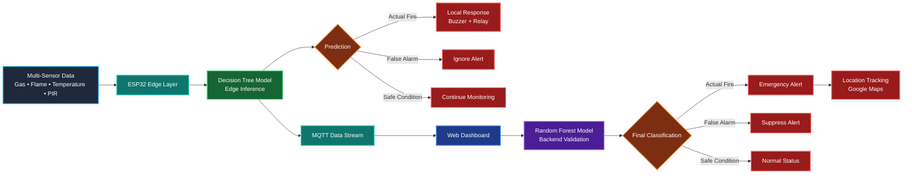
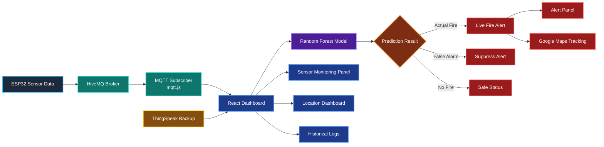

# FireProtect – IoT-Based Smart Fire Detection & Alert System

FireProtect is an intelligent fire detection and monitoring system that combines _IoT, MQTT-based real-time communication and Machine Learning_ to provide rapid fire detection, dynamic alerts and remote monitoring.

The system utilizes multiple environmental sensors connected to an ESP32 microcontroller for continuous monitoring. A hybrid Machine Learning architecture consisting of a _Decision Tree (Edge Model)_ and _Random Forest (Backend Model)_ improves detection accuracy while reducing false alarms. Real-time sensor data is transmitted through MQTT to a live web dashboard, while ThingSpeak serves as a backup cloud platform for data logging and retrieval.

---

## FireProtect Working Demo

**Website Link :** [https://fire-protect.lovable.app/](https://fire-protect.lovable.app/)

**Hardware & Software Demo Video :** [https://drive.google.com/file/d/1cCxq6fjby-Zyf2aZvRMEs4NEYt_Ee7rz/view?usp=sharing](https://drive.google.com/file/d/1cCxq6fjby-Zyf2aZvRMEs4NEYt_Ee7rz/view?usp=sharing)

---

## 1. Project Overview

FireProtect is an IoT-enabled smart fire detection and alert system designed for real-time monitoring, intelligent fire classification, and rapid emergency response.

Unlike traditional fire alarms that rely solely on threshold-based detection, FireProtect combines multi-sensor data fusion, MQTT communication, and Machine Learning to accurately classify events as:
- Actual Fire
- False Alarm
- Safe Condition

### Key Features

- Multi-sensor fire detection using Flame, Gas, Temperature, Humidity, and Motion sensing
- Hybrid Machine Learning architecture for intelligent fire classification
- MQTT-based real-time communication with low latency
- Edge-based fire prediction on ESP32
- Instant local alarm and relay activation
- Live monitoring dashboard with location tracking
- ThingSpeak backup cloud integration
- Historical data logging and incident monitoring

---

## 2. System Workflow

1. Sensors continuously monitor environmental conditions.
2. ESP32 collects readings from:
   - MQ-2 Gas Sensor
   - Flame Sensor
   - DHT11 Temperature & Humidity Sensor
   - PIR Motion Sensor
3. Sensor data is processed locally using Decision Tree-based edge logic.
4. Events are classified as:
   - Actual Fire
   - False Alarm
   - No Fire
5. If a fire risk is detected:
   - Buzzer activates immediately
   - Relay-controlled safety devices are triggered
6. Sensor readings and alerts are published to the MQTT broker.
7. The web dashboard receives real-time updates via MQTT.
8. The backend Random Forest model performs secondary validation.
9. Sensor data is stored in ThingSpeak for backup and historical analysis.
10. Users can monitor alerts, predictions, and sensor values through the dashboard.


---

## 3. Hardware Architecture & Sensor Programming

### Hardware Components
| Component | Purpose |
|------------|------------|
| ESP32 | Central processing and communication unit |
| MQ-2 Gas Sensor | Smoke and combustible gas detection |
| Flame Sensor | Flame detection using infrared sensing |
| DHT11 Sensor | Temperature and humidity monitoring |
| PIR Sensor | Human motion detection |
| Buzzer | Local emergency alert |
| Relay Module | Controls external safety devices |
| Power Supply | Stable system power source |

### Sensor Programming
- ESP32 initializes all sensors and communication modules.
- Continuous sensor acquisition is performed in real time.
- GPIOs are configured for sensor inputs and actuator outputs.
- Sensor values are analyzed using threshold logic and Decision Tree rules.
- Hazard conditions trigger immediate local actions.
- Sensor readings are simultaneously transmitted via MQTT and uploaded to ThingSpeak.

### Local Safety Actions
- Buzzer activation
- Relay switching
- Emergency event generation
- MQTT alert publishing

The system remains operational even during internet outages through local edge processing.


---

## 4. Machine Learning Integration

FireProtect uses a Hybrid Machine Learning Framework that combines edge intelligence with backend validation.



### _Decision Tree (Edge Model – ESP32)_
A lightweight Decision Tree model is trained offline and converted into rule-based if-else logic for deployment on the ESP32.

#### Responsibilities

- Real-time fire prediction
- Low-latency edge inference
- Offline operation
- Immediate alarm triggering

#### Input Features

- Gas Concentration
- Temperature
- Humidity
- Flame Detection
- PIR Motion Detection

#### Output Classes

- Actual Fire
- False Alarm
- No Fire

### _Random Forest (Backend Model)_

A Random Forest model is deployed within the web application backend to validate incoming sensor data and improve overall reliability.

#### Responsibilities

- Secondary fire classification
- False alarm reduction
- Intelligent dashboard alerts
- High-accuracy validation

#### Model Features

- Trained on 20,000+ fire and non-fire samples
- Feature scaling and preprocessing
- SMOTE-based class balancing
- Evaluated using:
  - Accuracy
  - Precision
  - Recall
  - F1 Score
  - Cross Validation

This dual-layer architecture combines the speed of edge computing with the accuracy of backend machine learning.

---

## 5. MQTT Implementation

FireProtect uses MQTT as its primary communication protocol for real-time data transmission.

### Communication Architecture

```text
ESP32 → HiveMQ Broker → Web Dashboard
```

### MQTT Features

- Publish–Subscribe Architecture
- Low-Latency Communication
- Real-Time Sensor Streaming
- Instant Fire Alerts
- Secure WebSocket Connectivity
- Scalable IoT Communication

### MQTT Topics

#### Sensor Data Topic

```text
firealarm/data
```

Contains:

- Gas readings
- Temperature values
- Humidity values
- Flame status
- PIR status

#### Alert Topic

```text
firealarm/alert
```

Contains:

- Fire alerts
- Alert severity
- Fire classification results
- Location metadata

### Benefits

- Instant dashboard updates
- No API polling overhead
- Faster emergency response
- Efficient real-time communication

---

## 6. ThingSpeak Cloud as a Backup

ThingSpeak serves as the secondary cloud infrastructure for FireProtect.

### Functions

- Backup sensor data storage
- Historical data visualization
- Long-term analytics
- Fallback monitoring
- System reliability enhancement

### Fallback Mechanism

If MQTT connectivity is disrupted:

1. The web application automatically switches to ThingSpeak APIs.
2. Latest sensor readings are retrieved periodically.
3. Monitoring remains uninterrupted.
4. Historical records remain accessible.

This ensures continuous monitoring even during network failures.

---

## 7. Website Integration

The FireProtect web platform provides centralized monitoring, intelligent alert management, and location-based incident tracking.

### Website Architecture


### Features

#### Real-Time Dashboard

- Live sensor monitoring
- MQTT-powered updates
- Fire status visualization

#### ML-Based Fire Classification

- Random Forest predictions
- Intelligent fire detection
- False alarm reduction

#### Live Alert Management

- Instant emergency notifications
- Alert severity indicators
- Incident tracking

#### Multi-Location Monitoring

- Monitor multiple fire-detection nodes
- Dynamic location selection
- Centralized management

#### Google Maps Integration

- Exact incident location tracking
- Navigation support
- Location-based response assistance

#### Historical Monitoring

- Sensor history
- Incident logs
- Backup cloud data access

#### Responsive Interface

- Desktop-friendly dashboard
- Mobile compatibility
- Fast and intuitive navigation


---

## 8. Applications

- Residential Homes
- Smart Home Safety Systems
- Commercial Buildings
- Warehouses and Storage Facilities
- Industrial Plants
- Laboratories
- Server Rooms and Data Centers
- Educational Institutions
- Public Infrastructure
- Smart City Fire Monitoring Networks

---

## 9. Technology Stack

### Hardware

- ESP32
- MQ-2 Gas Sensor
- Flame Sensor
- DHT11 Sensor
- PIR Sensor
- Buzzer
- Relay Module

### Embedded Software

- Arduino IDE
- Embedded C/C++
- Wi-Fi Libraries
- MQTT Libraries

### Machine Learning

- Python
- Scikit-Learn
- Decision Tree
- Random Forest
- Pandas
- NumPy
- SMOTE

### Web Application

- React
- TypeScript
- Vite
- MQTT.js
- Supabase

### Cloud Services

- HiveMQ
- ThingSpeak
- Supabase

---

## Future Enhancements

- Mobile Application Integration
- Camera-Based Fire Verification
- Automatic Sprinkler Activation
- SMS & Emergency Notifications
- AI-Based Predictive Fire Analytics
- LoRaWAN / NB-IoT Integration
- Smart City Deployment
- Voice Assistant Integration

---

## Team

**Saisha Verma (@Saisha0512)**  
**Ritisha Sood (@RitishaSood)**  
**Riya Singh (@riya-singh758)**
Department of Computer Science & Engineering  
Indira Gandhi Delhi Technical University for Women (IGDTUW)
